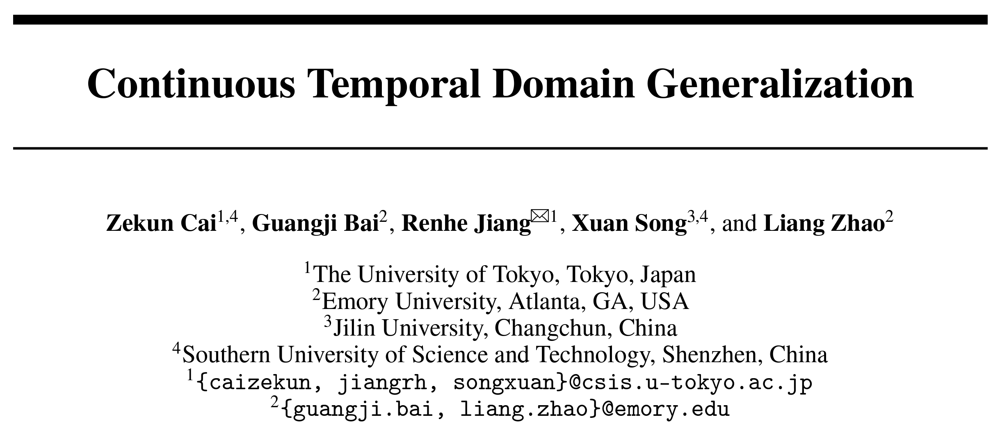
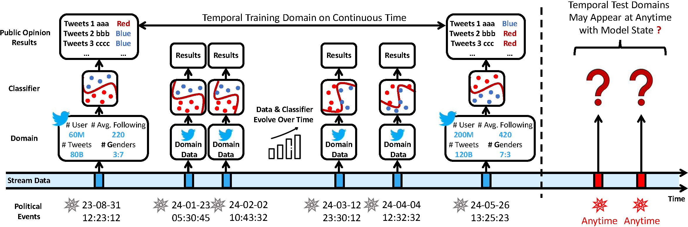
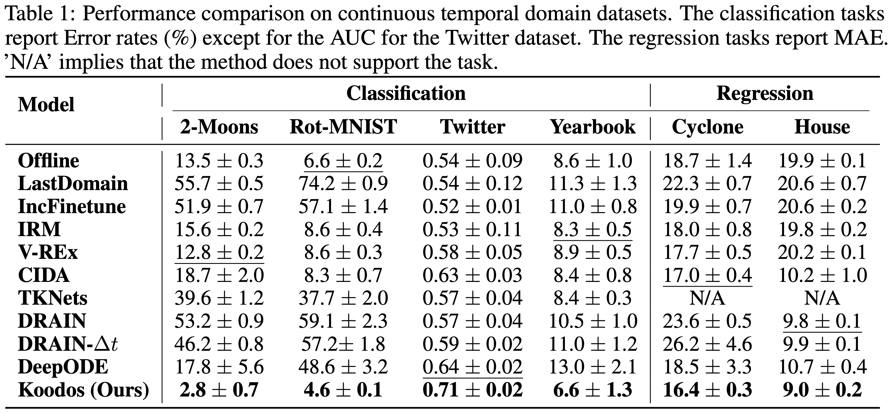
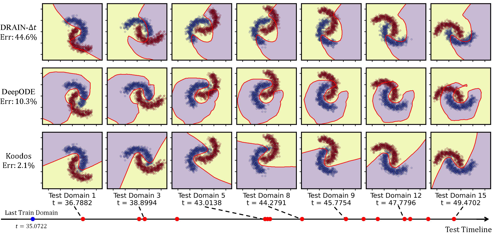
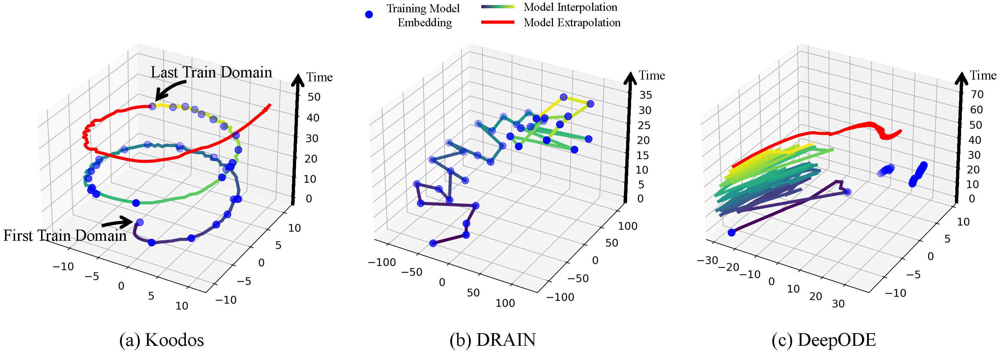
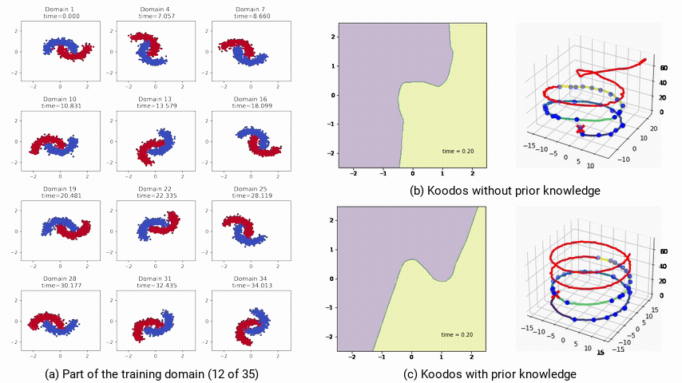

# NeurIPS24｜让模型预见未来：颠覆性动态系统设计引领时域泛化新革命

  
## 摘要

在实际应用中，数据集的数据分布往往随着时间而不断变化，预测模型需要持续更新以保持准确性。时域泛化（Temporal Domain Generalization，TDG）旨在预测未来数据分布，从而提前更新模型，使模型与数据同步变化。然而，传统方法假设领域数据（Domain Data）在固定时间间隔内收集，忽视了现实任务中数据集采集的随机性和不定时性，无法应对数据分布在连续时间（Continuous Time）上的变化。此外，传统方法也难以保证泛化过程在整个时间流中保持稳定和可控。

为此，本文提出了连续时域泛化（Continuous Temporal Domain Generalization，CTDG）任务，并设计了一个基于模型动力学的时域泛化框架Koodos，使得模型在连续时间中与数据分布的变化始终保持协调一致。Koodos通过库普曼算子（Koopman Operator）将模型的复杂非线性动态转化为可学习的连续动态系统（Continuous Dynamical System），同时利用先验知识以确保泛化过程的稳定性和可控性。实验表明，Koodos显著超越现有方法，为时域泛化开辟了全新的研究方向。

## 作者

  
论文链接：https://arxiv.org/pdf/2405.16075  
开源代码：https://github.com/Zekun-Cai/Koodos/  
**我们在代码库中提供了详细的逐步教程，涵盖Koodos的实现和可视化演示。十分钟即可快速运行，力荐尝试!**

## 情景导入

在实际应用中，训练数据的分布通常与测试数据不同，导致模型在训练环境之外的泛化能力受限。**领域泛化**（Domain Generalization, DG）作为一种重要的机器学习策略，旨在学习一个能够在未见目标领域中也保持良好表现的模型。近年来研究人员发现，在动态环境中，领域数据（Domain Data）分布往往具有显著的时间依赖性，这促使了**时域泛化**（Temporal Domain Generalization, TDG）技术的快速发展。时域泛化将多个领域视为一个时间序列而非一组独立的静态个体，利用历史领域预测未来领域，从而实现对模型参数的提前调整，显著提升了传统DG方法的效果。

然而，现有的时域泛化研究集中在“**离散时间域**”假设下，即假设领域数据在固定时间间隔（如逐周或逐年）收集。基于这一假设，概率模型被用于预测时域演变，例如通过隐变量模型生成未来数据，或利用序列模型（如LSTM）预测未来的模型参数。然而在现实中，**领域数据的观测并不总是在离散、规律的时间点上，而是随机且稀疏地分布在连续时间轴上**。例如，图 1 展示了一个典型的例子——基于推文数据进行社交媒体舆情预测。与传统 TDG 假设的领域在时间轴上规律分布不同，实际中我们只能在特定事件（如总统辩论）发生时获得一个域，而这些事件的发生时间并不固定。同时，**概念漂移**（Concept Drift）在时间轴上发生，即领域数据分布随着时间不断演变：如活跃用户增加、新交互行为形成、年龄与性别分布变化等。理想情况下，每个时态域对应的预测模型也应随时间逐渐调整，以应对这种概念漂移。最后，由于未来的域采集时间未知，我们希望可以泛化预测模型到未来任意时刻。

*图1：连续时域泛化示意图。图中展示了通过推文训练分类模型进行舆情预测。其中训练域仅能在特定政治事件（如总统辩论）前后采集。我们希望通过这些不规律时间分布的训练域来捕捉分布漂移，并最终使模型能够推广到任意未来时刻。*

事实上，领域分布在连续时间上的场景十分常见，例如：

**事件驱动的数据采集**：仅在特定事件发生时采集领域数据，事件之间没有数据。  
**流数据的随机观测**：领域数据在数据流的任意时间点开始或结束采集，而非持续进行。  
**离散时态域但缺失**：尽管领域数据基于离散时间点采集，但部分时间节点的领域数据缺失。  

为了应对这些场景中的模型泛化，我们提出了“**连续时域泛化**”（Continuous Temporal Domain Generalization, CTDG）任务，其中观测和未观测的领域均分布于连续时间轴上随机的时间点。**CTDG 关注于如何表征时态领域的连续动态，使得模型能够在任意时间点实现稳定、适应性的调整，从而完成泛化预测**。

## 核心挑战

CTDG任务的挑战远超传统的TDG方法。CTDG不仅需要处理不规律时间分布的训练域，更重要的是，它旨在让模型**泛化到任意时刻**，即要求在连续时间的每个点上都能精确描述模型状态。而TDG方法则仅关注未来的单步泛化：在观测点优化出当前模型状态后，只需将其外推一步即可。这使得CTDG区别于TDG任务：**CTDG的关键在于如何在连续时间轴上同步数据分布和模型参数的动态演变，而不是仅局限于未来某一特定时刻的模型表现**。

具体而言，与TDG任务相比，CTDG的复杂性主要来自以下几个尚未被充分探索的核心挑战：

- **如何建模数据动态并同步模型动态**  
CTDG要求在连续时间轴上捕捉领域数据的动态，并据此同步调整模型状态。然而，数据动态本身难以直接观测，需要通过观测时间点来学习。此外，模型动态的演变过程也同样复杂，理解数据演变如何驱动模型演变也充满挑战，这构成了CTDG的首要问题。

- **如何在高度非线性模型动态中捕捉主动态**  
领域数据的预测模型通常依赖过参数化（over-parametrized）的深度神经网络，模型动态因此呈现出高维、非线性的复杂特征。这导致模型的主动态嵌藏在大量潜在维度中。如何有效提取并将这些主动态映射到可学习的空间，是CTDG任务中的另一重大挑战。

- **如何确保长期泛化的稳定性和可控性**  
为实现未来任意时刻的泛化，CTDG必须确保模型的长期稳定性。此外，在许多情况下，我们可能拥有数据动态的高层次先验知识。如何将这些先验知识嵌入CTDG的优化过程中，进而提升泛化的稳定性和可控性，是一个重要的开放性问题。

## 技术方法

### 问题定义

在 CTDG 中，一个域 $`\mathcal{D}(t)`$ 表示在时间 $`t`$ 采集的数据集，由实例集 $`\{(x_i^{(t)}, y_i^{(t)})\}_{i=1}^{N(t)}`$ 组成，其中 $`x_i^{(t)} \in X(t)`$， $`y_i^{(t)} \in Y(t)`$ 和 $`N(t)`$ 分别为特征值，目标值和实例数。我们重点关注连续时间上的渐进性概念漂移，表示为领域数据的条件概率分布 $`P(Y(t) | X(t))`$ 随时间平滑变化。

在训练阶段，模型接收一系列在不规律时间点 $`\mathcal{T} = \{t_1, t_2, \ldots, t_T\}`$ 上收集的观测域 $`\{\mathcal{D}(t_1), \mathcal{D}(t_2), \ldots, \mathcal{D}(t_T)\}`$，其中每个时间点 $`t_i \in \mathcal{T}`$ 是定义在连续时间轴 $`\mathbb{R}^+`$ 上的实数，且满足 $`t_1 < t_2 < \ldots < t_T`$。在每个 $`t_i \in \mathcal{T}`$ 上，模型学习到领域数据 $`\mathcal{D}(t_i)`$ 的预测函数 $`g(\cdot; \theta(t_i))`$，其中 $`\theta(t_i)`$ 表示 $`t_i`$ 时刻的模型参数。CTDG 的目标是建模参数的动态变化，以便在任意给定时刻 $`s \notin \mathcal{T}`$ 上预测模型参数 $`\theta(s)`$，从而得到泛化模型 $`g(\cdot; \theta(s))`$。

在后续部分中，我们使用简写符号 $`\mathcal{D}_i`$、$`X_i`$、$`Y_i`$ 和 $`\theta_i`$，分别表示在时间 $`t_i`$ 上的 $`\mathcal{D}(t_i)`$、$`X(t_i)`$、$`Y(t_i)`$ 和 $`\theta(t_i)`$。

### 设计思路
我们的方法通过模型与数据的同步、动态简化表示，以及高效的联合优化展开。具体思路如下：  
1. **同步数据和模型的动态**  
我们证明了连续时域中模型参数的连续性，而后借助神经微分方程建立模型动态系统，从而实现模型动态与数据动态的同步。
2. **表征高维动态到低维空间**  
我们将高维模型参数映射到一个结构化的库普曼空间（Koopman Space）中。该空间通过可学习的低维线性动态来捕捉模型的主要动态。
3. **联合优化模型与其动态**  
我们将单个领域的模型学习与各时间点上的连续动态进行联合优化，并设计了归纳偏置的约束接口，通过端到端优化保证泛化的稳定性和可控性。

### 解决方案
#### Step 1. 数据动态建模与模型动态同步

- **分布变化的连续性假设**  
  我们首先假设数据分布在时间上具有连续演化的特性，即条件概率分布 $`P_t(Y|X)`$ 随时间平滑变化，其演化规律由一个函数 $`f`$ 所描述的动态系统刻画。尽管真实世界中的渐进概念漂移可能较为复杂，但因概念漂移通常源于底层的连续过程（如自然、生物、物理、社会或经济因素），这一假设不失普适性。

- **分布变化引发的模型参数连续演化**  
  基于上述假设，模型的函数功能空间 $`g(\cdot; \theta_t)`$ 应随数据分布变化同步调整。我们借助常微分方程来描述这一过程：  
  $`\frac{d}{dt} g(\cdot; \theta_t) = f(g(\cdot; \theta_t), t)`$   
  由此可推导出模型参数 $`\theta_t`$ 的演化满足：  
  $`\frac{d\theta_t}{dt} = J_g(\theta_t)^{-1} f(g(\cdot; \theta_t), t)`$  
  其中，$`J_g(\theta_t)`$ 是 $`g`$ 对 $`\theta_t`$ 的雅可比矩阵。  
  这一结果表明，**如果数据分布的演化在时间上具有连续性，那么 $`\theta_t`$ 的演化过程也具有连续性**，即模型参数会随数据分布的变化而平滑调整。**上式为 $`\theta_t`$ 建立了一个由微分方程描述的模型动态系统**。

- **模型动态系统学习**  
  由于数据动态 $`f`$ 的具体形式未知，直接求解上述微分方程并不可行。为此，我们引入一个由可学习的函数 $`h(\theta_t, t; \phi)`$ 描述的神经微分方程（Neural ODE），通过鼓励模型动态和数据动态之间的拓扑共轭（Topological Conjugation）关系来逼近真实动态。具体而言，拓扑共轭要求通过泛化获得的模型参数与直接训练得到的参数保持一致。为此，我们设定以下优化目标，以学习 $`h`$ 的参数 $`\phi`$：  
  $`\phi = \arg \min_{\phi} \sum_{i=1}^{T} \sum_{j=1}^{i} \|\theta_i - \theta^{j \rightarrow i}_i\|_2`$   
  其中，$`\theta_i`$ 通过在时刻 $`t_i`$ 的领域上直接训练获得， $`\theta^{j \rightarrow i}_i`$ 则表示从时间 $`t_j`$ 通过动态 $`h`$ 演变至 $`t_i`$ 的泛化参数：  
  $`\theta^{j \rightarrow i}_i = \theta_j + \int_{t_j}^{t_i} h(\theta_{\tau}, \tau; \phi) \, d\tau`$  
  通过这一优化过程，我们建立了模型动态与数据动态之间的同步机制。借助动态函数 $`h`$，我们可以在任意时刻精确求解模型的状态。

#### Step 2. 通过库普曼算子简化模型动态

- **非线性动态线性化**  
在实际任务中，预测模型通常依赖于过参数化的深度神经网络，使得模型动态 $`h`$ 呈现为在高维空间中纠缠的非线性动态。直接对 $`h`$ 建模不仅计算量大，且极易导致泛化不稳定。然而，$`h`$ 受数据动态 $`f`$ 的支配，而数据动态通常是简单、可预测的。这意味着在过参数化空间中，模型的主动态（Principal Dynamics）可以在适当转换的空间内进行更易于管理的表示。受此驱动，我们引入**库普曼理论**（Koopman Theory）来简化复杂的模型动态。库普曼理论在保持动态系统特征的同时将复杂的非线性动态线性化。  
具体而言，我们定义一个库普曼嵌入函数 $`\phi`$，将原始的高维参数空间映射到一个低维的库普曼空间中：  
$`z = \varphi(\theta)`$  
其中，$`z`$ 表示库普曼空间中的低维表示。通过库普曼算子 $`K`$，我们可以在线性空间中刻画 $`z`$ 的动态：  
$`\frac{dz}{dt} = Kz`$  
一旦获得了简化的动态表示，我们可以在库普曼空间中更新模型参数，而后将其反映射回原始参数空间：  
$`z^{j\rightarrow i}_i =  z_j + \int\nolimits_{t_j}^{t_i} \mathcal{K} z_{\tau} \, d\tau`$   
$`\theta^{j\rightarrow i}_i=\varphi^{-1}(z^{j\rightarrow i}_i)`$  
最终，通过库普曼算子的引入，我们实现了对模型动态的简化，保证了泛化过程的稳健性。  

#### Step 3. 联合优化与先验知识结合

- **模型及其动力学的联合优化**  
我们对多个组件同时施加约束确保模型能稳定泛化，其包含以下关键项：  
  - 预测准确性：通过最小化预测误差，使预测模型在每个观测时间点都能准确预测实际数据。  
  - 泛化准确性：通过最小化预测误差，使泛化模型在每个观测时间点都能准确预测实际数据。  
  - 重构一致性：确保模型参数在原始空间与库普曼空间之间的转换具有一致性。  
  - 动态保真性：约束库普曼空间的动态行为，使得映射后的空间符合预期的动态系统特征。  
  - 参数一致性：确保泛化模型参数映射回原始空间后与预测模型参数保持一致。  

- **利用库普曼算子评估和控制泛化过程**  
引入库普曼理论的另一优势在于，我们可以通过库普曼算子的**谱特性**来评估模型的长期稳定性，此外，还可以在库普曼算子中施加约束来控制模型的动态行为。
  1. **系统稳定性评估**  
   通过观察库普曼算子的特征值，可以判断系统是否稳定：  
   - 若所有特征值实部为负，系统会稳定地趋向于一个平衡状态。  
   - 若存在特征值实部为正，系统将变得不稳定，模型在未来可能会崩塌。  
   - 若特征值实部为零，系统可能表现出周期性行为。  
   通过分析这些特征值的分布，我们可以预测系统的长期行为，识别模型在未来是否可能出现崩溃的风险。  
  2. **泛化过程约束**    
   我们可以通过对库普曼算子施加显式约束来调控模型的动态行为。例如：  
   - 周期性约束：当数据动态为周期性时，可将库普曼算子 $`\mathcal{K}`$ 设为反对称矩阵，使其特征值为纯虚数，从而使模型表现出周期性行为。  
   - 低秩近似：将 $`\mathcal{K}`$ 表示为低秩矩阵，有助于控制模型的自由度，避免过拟合到次要信息。  
   通过这些手段，我们不仅提高了泛化的长期稳定性，还增强了模型在特定任务中的可控性。  

## 实验

### 实验设置
为验证算法效果，我们使用了合成数据集和多种真实世界场景的数据集：
- **合成数据集**：包括 Rotated 2-Moons 和 Rotated MNIST 数据集，通过在连续时间区间内随机生成时间戳，并对 Moons 和 MNIST 数据按时间戳逐步旋转生成连续时域。  
- **真实世界数据集**：
**事件驱动数据集** Cyclone：基于热带气旋的卫星图像预测风力强度，气旋发生日期对应连续时域。
**流数据集** Twitter 和 House：分别从任意时间段抽取推文和房价数据流构成一个领域，多次随机抽取形成连续时域。
**不规则离散数据集** Yearbook：人像图片预测性别，从 84 年中随机采样 40 年数据构成连续时域。

### 实验结果与分析
**定量分析**   
我们首先对比了 Koodos 方法与各基线方法的定量性能。表1显示，Koodos 方法在所有数据集上展现了显著的性能提升。在合成数据集上，Koodos 能够轻松应对持续的概念漂移，而所有基线方法在这种场景下全部失效。在真实世界数据集上，尽管某些基线方法（如 CIDA、DRAIN 和 DeepODE）在少数场景中略有表现，但其相较于简单方法（如 Offline）的改进非常有限。相比之下，**Koodos 显著优于所有现有方法**，彰显出在时域泛化任务中考虑分布连续变化的关键作用。
  

**定性分析**  
- **决策边界**  
为直观展示泛化效果，我们在 Rotated 2-Moons 数据集上进行了决策边界的可视化。该任务具有极高难度：模型需在0到35秒左右的35个连续时域上训练，随后泛化到不规律分布在35到50秒的15个测试域。而现有方法通常只能泛化至未来的一个时域（T+1），且难以处理不规律的时间分布。  
图3从15个测试域中选取了7个进行可视化。结果清晰地表明，基线方法在应对连续时域的动态变化时表现不足。随着时间推进，决策边界逐渐偏离理想状态。尤其是最新的 DRAIN 方法（ICLR23）在多步泛化任务中明显失效。相比之下，**Koodos 在所有测试域上展现出卓越的泛化能力，始终保持清晰、准确的决策边界，与实际数据分布变化高度同步。这一效果突显了 Koodos 在时域泛化任务中的革命性优势**。
  
*图3：2-Moons数据集决策边界的可视化（紫色和黄色表示数据区域，红线表示决策边界）。从上到下比较了两种基线方法和Koodos；从左到右显示了部分测试域（15选7，所有测试域的分布在时间轴上用红点标记）。*  

- **模型演变轨迹**  
为更深入地分析模型的泛化能力，我们通过t-SNE降维，将不同方法的模型参数的演变过程（Model Evolution Trajectory）在隐空间中可视化。
可以看出，Koodos 的轨迹呈现出平滑而有规律的螺旋式上升路径，从训练域平滑延伸至测试域。这一轨迹表明，Koodos 能够在隐空间中有效捕捉数据分布的连续变化，并随时间自然地扩展泛化。
相比之下，基线模型的轨迹在隐空间中缺乏清晰结构，随着时间推移，逐渐出现明显的偏离，未能形成一致的动态模式。

*图4：模型状态在隐空间中的时空轨迹。Koodos展现出与数据动态和谐同步的模型动态。*  

**时域泛化的分析与控制**  
在 Koodos 模型中，库普曼算子为分析模型动态提供了有效手段。我们对 Koodos 在 2-Moons 数据集上分析表明，库普曼算子的特征值在复平面上分布在稳定区和不稳定区，这意味着 Koodos 在中短期内能稳定泛化，但在极长时间的预测上将会逐渐失去稳定性，偏离预期路径（图5b）。  
为提升模型的稳定性，我们通过将库普曼算子配置为反对称矩阵（即 Koodos$`^+`$ 版本），确保所有特征值为纯虚数，使模型具有周期性稳定特性。在这一配置下，Koodos$`^+`$ 展现出高度一致的轨迹，即使在长时间外推过程中依然保持稳定和准确，证明了引入先验知识对增强模型稳健性的效果（图5c）。  
  
*图5：非受控和受控条件下的极长期泛化预测模型轨迹。a：部分训练域数据；b：不受控，模型最终偏离预期；c：受控，模型始终稳定且准确。*  

## 未来工作
**生成式模型扩展**：时域泛化与生成式模型任务有天然的关联，Koodos 所具备的泛化能力能够为神经网络生成技术带来新的可能。  
**非时态泛化任务**：Koodos 的应用并不局限于时域泛化，它也可以适用于其他分布变化的任务中。我们计划探索其在非时态领域的应用。  
**大模型集成**：我们将探索时域泛化在大模型中的集成，帮助LLM在复杂多变的分布中保持鲁棒性和稳定性。  

我们对时域泛化任务在未来的广阔应用前景充满期待。如有任何问题或合作意向，欢迎联系我们！  
邮箱：caizekun@csis.u-tokyo.ac.jp  
GitHub：https://github.com/Zekun-Cai/Koodos/   
Paper：https://arxiv.org/pdf/2405.16075  
